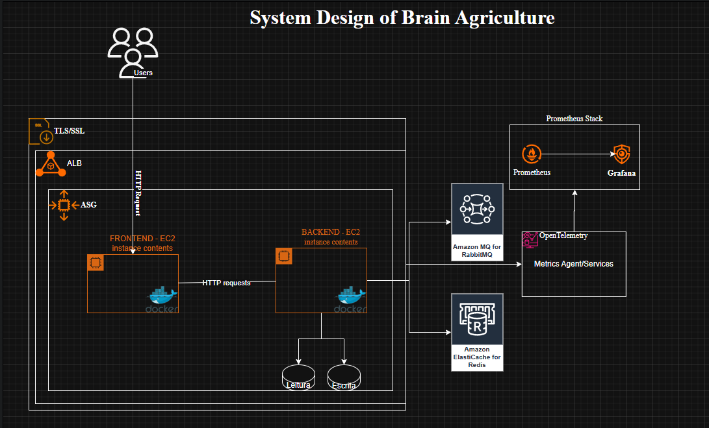

# 🌾 Brain Agriculture — Sistema de Cadastro de Produtores Rurais

Este projeto é uma solução para o desafio técnico de desenvolvimento de uma aplicação backend que gerencia o cadastro de produtores rurais, seguindo princípios de Clean Architecture, SOLID, boas práticas de desenvolvimento, testes automatizados e escalabilidade.

---

## 📐 Arquitetura do Sistema



A arquitetura foi planejada para suportar **alta escalabilidade**, **observabilidade** e **boas práticas de engenharia**. Utiliza:

* **Frontend/Backend separados** em containers Docker
* Balanceamento de carga via **Application Load Balancer (ALB)**
* Comunicação assíncrona via **RabbitMQ**
* Cache de alta performance com **Redis (ElastiCache)**
* Observabilidade com **OpenTelemetry, Prometheus e Grafana**

---

## ⚙️ Tecnologias e Conceitos Aplicados

* **Python 3.10 + Django**
* **PostgreSQL + Redis + RabbitMQ**
* **Docker + Docker Compose**
* **Pytest** para testes de integração
* **Clean Architecture (Camadas: Domain, Application, Infra)**
* **SOLID, KISS, Clean Code**
* **OpenAPI (via drf-spectacular)**
* **OpenTelemetry para métricas**

---

## 🧪 Testes Automatizados

Os testes de integração cobrem os seguintes cenários:

* ✅ Criação, edição e exclusão de produtores
* ✅ Validação de CPF/CNPJ
* ✅ Validação de área agricultável + vegetação ≤ área total
* ✅ Várias culturas por propriedade e safra
* ✅ Dashboard de métricas: total de hectares e total de fazendas

Para rodar os testes:

```bash
docker compose exec api pytest || docker compose exec api python manage.py test
```
---

## 🚀 Como subir o projeto com Docker Compose

```bash
git clone https://github.com/seu-usuario/brain-ag.git
cd brain-ag

# Subir os containers
docker compose up -d --build
```

Acesse:

* API: [http://localhost:8000/api/v1/produtor/](http://localhost:8000/api/v1/produtor/)
* Swagger UI: [http://127.0.0.1:8000/](http://127.0.0.1:8000/)

---

## 📁 Estrutura de Pastas

```bash
.
├── core/                     # Configurações centrais do Django (settings, urls, etc)
├── brain-ag/                 # Código principal da aplicação
│   ├── domain/               # Camada de domínio (entidades e regras de negócio puras)
│   ├── application/          # Camada de orquestração da lógica de negócio com casos de uso (usecases)
│   ├── infra/                # Infraestrutura: repositórios, serviços externos, persistência
│   ├── management/           # Comandos customizados do Django
│   ├── migrations/           # Migrations do banco de dados
│   ├── models/               # Models do Django (representação do banco)
│   ├── admin.py              # Registro das models no Django Admin
│   ├── apps.py               # Configuração do app Django
│   ├── managers.py           # Managers personalizados para models
│   └── signals.py            # Handlers para sinais do Django                  
├── tests/                    # Testes automatizados
├── docker-compose.yml        # Orquestração de containers
├── Dockerfile                # Imagem Docker para a aplicação
└── README.md                 # Documentação do projeto

```

---

## 📬 Observações finais

* Os testes cobrem as regras de negócio e integram camadas da aplicação
* O sistema foi desenhado com foco em performance, escalabilidade e manutenibilidade
* O uso de Docker permite deploy rápido e ambiente replicável

---

## 🤝 Contato

**Felipe Silva**
[LinkedIn](https://www.linkedin.com/in/felipeitdev/) | [GitHub](https://github.com/felipeit/)
Backend Engineer • Python • Clean Architecture • DDD • TDD • Ports and Adapters • AWS • Observability

---

